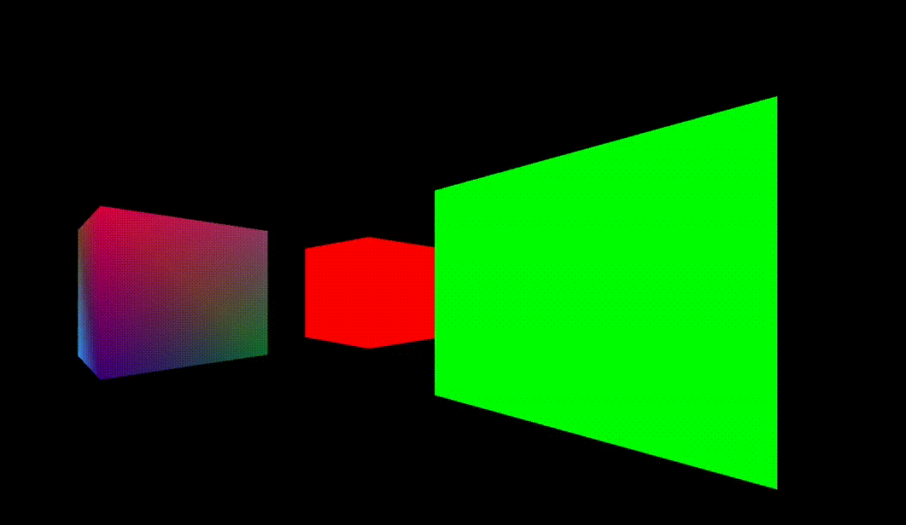

## Trabalho de Computação Gráfica

Código fonte referente ao trabalho da disciplina de computação gráfica T01-2023-2



### Ambiente 

O projeto foi desenvolvido em um ambiente `Linux`, mais especificamente o `Ubuntu 22.04` rodando no `WSL2`

### Dependências

- `OpenGL: 4.2`
- `GLEW: 2.2.0`
- `FreeGlut: 2.08.01`

### Compilação e execução
Na raíz do projeto, execute as seguintes linhas de comando para:

Compilar
```
g++ ./source/main.cpp -o app -std=c++11 -Wall -lGL -lGLU -lglut -lGLEW
```

Executar
```
./app
```
